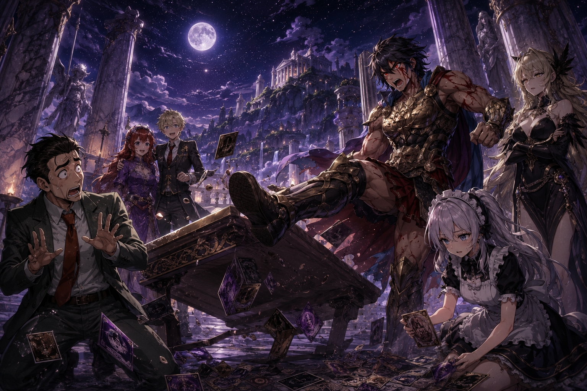

<!--
every game here asked a question first ✦
-->

  

  <h2>✦ Devil Doll Entertainment</h2>

<strong>Games born from the ecosystem.</strong> 
Each one gets to make its own rules かわいい

 

## 🎮 What this is ✦

**Devil Doll Entertainment** is the game development realm of the **Sxnnyside Project Ecosystem**.

Games, visual novels, interactive experiences, mods, and the occasional thing that is technically a game because we said so.

The projects don't share an engine or a genre.

They share a refusal to exist without a reason.

### Philosophy

> *"Every game should have something to say, even when it doesn't say it out loud."*

Some projects want you to play.
Some want you to explore.

Some just want to see what happens when the rules change たぶん

## 🧠 The Stack ✦

  

<strong>✦ What's in the stack and why</strong>

 

| Technology           | Role                                                  |
| -------------------- | ----------------------------------------------------- |
| **Ruby**             | RPG Maker development and game scripting              |
| **GDScript / Godot** | Original game development and interactive experiences |
| **Lua**              | Game scripting and runtime extensions                 |
| **Java**             | Minecraft mods and ecosystem extensions               |

The engine adapts to the game.

**Not the other way around.**

## ◼ Projects ✦

| Project                                                                                            | Description                                                                                                                                                |
| -------------------------------------------------------------------------------------------------- | ---------------------------------------------------------------------------------------------------------------------------------------------------------- |
| **Psycodead DEMO**                                                                                 | Boss fights with no narrative context — just the tension of figuring out what the game expects from you.                                                   |
| **VoidTech DEMO**                                                                                  | Turn-based combat built around creatures, synergies, and strategic decisions.                                                                              |
| **Enclover Moonlight**                                                                             | A visual novel built around branching routes where the choices are not simply right or wrong.                                                              |
| **Legacy**                                                                                         | A classic fantasy 2D platformer focused on exploration without a map holding your hand.                                                                    |
| **[Curricuneko](https://houjousxnnyside.github.io/curricuneko/)**                                  | A playable introspection that turns fragments of creative identity into an interactive experience.                                                         |
| **[BetterBattleOrientation](https://github.com/devil-doll-entertainment/betterbattleorientation)** | A modular RPG Maker VX Ace battle system that replaces the default front-view presentation with a lateral layout, configurable motion, and visual effects. |
| **Emerald Essentials**                                                                             | A Minecraft Java mod that gives emeralds a more meaningful role within the game's economy and progression.                                                 |
| **[MC-AutomaticPackage](https://github.com/devil-doll-entertainment/mc-automatic-package)**        | A lightweight Fabric mod for Minecraft Java that lets you toggle a resource pack with a single keybind.                                                    |

Not every project has a public repository. Some are still private, experimental, or simply waiting for their moment.

 

  <a href="https://www.sxnnysideproject.com/en/realms/devil-doll-entertainment">
    <strong>Explore Devil Doll Entertainment →</strong>
  </a>

## 🟣 Distribution ✦

Public projects are released through their respective repositories and distribution channels.

Private games, demos, prototypes, and selected builds may be distributed independently through the Sxnnyside Project ecosystem.

  

## ─ Find us ✦

  <a href="https://sxnnysideproject.com">Website</a>
  &nbsp;·&nbsp;
  <a href="https://www.instagram.com/sxnnyside_project">Instagram</a>
  &nbsp;·&nbsp;
  <a href="https://x.com/sxnny_project">X</a>
  &nbsp;·&nbsp;
  <a href="https://www.youtube.com/channel/UCjFe8XrkDPgDdqh5Y4Uw7KA">YouTube</a>
  &nbsp;·&nbsp;
  <a href="mailto:houjou.sxnnyside@sxnnyside.com">Email</a>

---

  
    Built with structure. Dressed in chaos ✦
  

